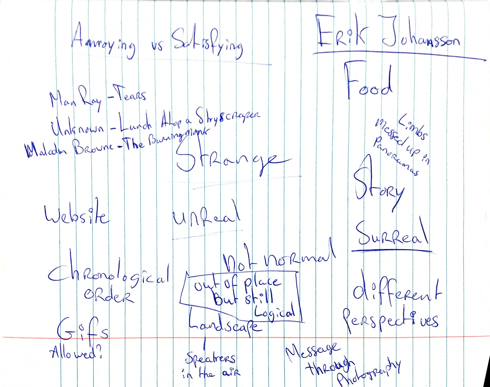

Assignments
============

## Introduction

    

    	
    

    

    	
Basically the idea was to make photographs which are a little <b>out of place</b>. Meaning that at first sight (the first second you see the photograph) the picture looks normal, but actually something is very <b>strange</b> or <b>surreal</b>. On the left is a picture of the brainstorm for the topic.

    

## 1st Exercise Topic: "Movement and Depth of Field"

1. Movement:

   1. Frozen Movement

      1. Captured Movement
      2. Panning

   2. Depth of Field

      1. Small Depth of Field
         2.1a First plane focused / background blurry
         2.1b First plane blurry / background focused
         2.1c First and last planes blurry / middle plane focused
         2.2 All planes focused

   3. 

          

          

          

      

## 2nd Exercise Topic: "Light and Shooting Angle"

## 3rd Exercise Topic: "Color"

## Final Portfolio

